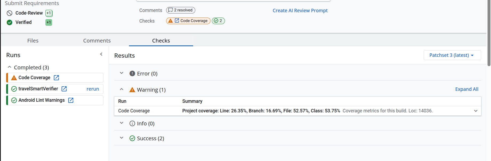
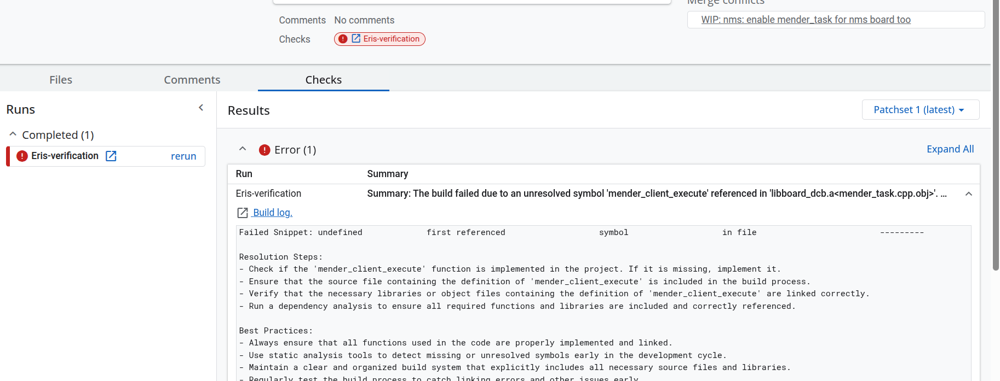

# checks-jenkins

[](https://opensource.org/licenses/Apache-2.0)
[](https://www.gerritcodereview.com/)

`checks-jenkins` is a Gerrit plugin that implements the [Gerrit Checks API](https://gerrit-review.googlesource.com/Documentation/pg-plugin-checks-api.html) specifically for **Jenkins CI**.
It surfaces Jenkins build statuses, logs, test results, and code coverage metrics directly within the Gerrit change screen, providing a seamless CI/CD feedback loop for developers.



## 🚀 Features

- **Real-time Status**: Monitor Jenkins build progress (Pending, Running, Success, Failure) within the Gerrit UI.
- **Detailed Feedback**: Provides links to build artifacts, warnings-ng reports, JUnit test failures, and build-failure explanations. When a build fails, the plugin queries the Jenkins [Error Explanation](https://plugins.jenkins.io/error-explanation/) plugin to surface human-readable failure reasons directly in the check result.

  

- **Code Coverage**: Per-file coverage annotations on diffs, file-list columns, and a low-coverage alert check (requires Jenkins [Code Coverage API](https://plugins.jenkins.io/code-coverage-api/) plugin).
- **Rerun Triggers**: Directly trigger a Jenkins job rerun from the Gerrit interface.
- **Streamlined Workflow**: Reduces the need to leave Gerrit to check CI status on the Jenkins dashboard.

## 🛠 Prerequisites

- **Gerrit**: 3.x or higher.
- **Jenkins**: A running instance with:
  - [Gerrit Checks API Plugin](https://plugins.jenkins.io/gerrit-checks-api/)
  - [Code Coverage API Plugin](https://plugins.jenkins.io/code-coverage-api/) *(optional — for coverage features)*
- **Core Checks Plugin**: This plugin requires the standard Gerrit `checks` plugin to be installed.

## 📦 Installation

1. **Build the plugin**:
    Using Bazel (standard Gerrit plugin build system):
    ```bash
    bazel build plugins/checks-jenkins:checks-jenkins
    ```
2. **Deploy to Gerrit**:
    Copy the .jar file to your Gerrit installation's plugin directory:
    ```bash
    cp bazel-bin/checks-jenkins.jar /path/to/gerrit/plugins/
    ```
3. **Reload the plugin**:
   Waiting automatic reload or:
   ```bash
   ssh -p 29418 user@gerrit-host gerrit plugin reload checks-jenkins
   ```

## ⚙️ Configuration

The plugin uses Gerrit's project-level or global configuration under the `jenkins` section.

### Basic Jenkins connection

**`gerrit.config`** (global) or **`project.config`** (per-project, in `refs/meta/config`):

```ini
[plugin "checks-jenkins"]
    url = https://jenkins.example.com/
    user = gerrit-ci-user
```

Authentication uses the `user` field. If the Gerrit user is already authenticated with Jenkins (e.g., via SSO), omit `user` and the plugin uses cookie-based `credentials: 'include'`.

### Multi-instance (per-project)

```ini
[jenkins "my-jenkins"]
    url = https://jenkins.example.com/
    user = gerrit-ci-user
```

The `name` field is the subsection key (`my-jenkins`). Multiple Jenkins instances can be configured per project.

### Code Coverage

Enable coverage reporting by adding the `coverage` key:

```ini
[plugin "checks-jenkins"]
    url = https://jenkins.example.com/
    user = gerrit-ci-user
    coverage = true
```

Or per-instance:

```ini
[jenkins "my-jenkins"]
    url = https://jenkins.example.com/
    user = gerrit-ci-user
    coverage = true
```

When enabled, the plugin queries the Jenkins [Code Coverage API](https://plugins.jenkins.io/code-coverage-api/) endpoints for the most recent completed build and surfaces:

| Feature | Location | Description |
|---|---|---|
| **Line coverage** | Diff view | Covered / missed annotations on modified lines (`COVERED` / `NOT_COVERED` ranges) |
| **File percentages** | File list columns | Absolute and incremental coverage percentages per file |
| **Low-coverage alert** | Checks tab | `Code Coverage` check run warns when a file's incremental coverage drops below 70% |
| **Project stats** | Checks tab | Fallback summary with line/branch/file/class-level coverage when no files are below threshold |

### Low-Coverage-Reason footer

To suppress low-coverage warnings on a change (demoting them from `WARNING` to `INFO`), add a footer to the commit message:

```
Low-Coverage-Reason: HARD_TO_TEST
```

Valid reasons:

| Prefix | Meaning |
|---|---|
| `TRIVIAL_CHANGE` | Minimal logic change, not worth testing |
| `TESTS_ARE_DISABLED` | Tests exist but are temporarily disabled |
| `TESTS_IN_SEPARATE_CL` | Tests will be added in a follow-up change |
| `HARD_TO_TEST` | The change is inherently difficult to test |
| `COVERAGE_UNDERREPORTED` | Coverage tool misses lines that are actually exercised |
| `LARGE_SCALE_REFACTOR` | Behavior-preserving restructuring |
| `EXPERIMENTAL_CODE` | Prototype or experimental change |
| `OTHER` | None of the above (provide details after prefix) |

A malformed reason (not starting with one of the prefixes above) triggers a separate `Low-Coverage-Reason Format Check` warning.

> 📖 See [Configuration](docs/configuration.md) for the full config reference, [Coverage System](docs/coverage-system.md) for coverage internals, and [Caching](docs/caching.md) for the cache strategy.

## 📖 Documentation

Detailed technical documentation is available in the [`docs/`](docs/) directory:

| Document | Description |
|---|---|
| [Architecture](docs/architecture.md) | High-level plugin architecture, module graph, build pipeline, and key design decisions |
| [Backend](docs/backend.md) | Java backend classes — REST endpoints, config resolution, and auth proxy |
| [Frontend](docs/frontend.md) | TypeScript frontend — checks provider, enrichment pipeline, coverage client |
| [Data Flow](docs/data-flow.md) | Sequence diagrams for config, checks polling, coverage, and rerun flows |
| [Configuration](docs/configuration.md) | Full config reference — global, per-project, multi-instance, auth modes |
| [Coverage System](docs/coverage-system.md) | Coverage endpoints, line annotations, low-coverage alert, `Low-Coverage-Reason` footer |
| [Caching](docs/caching.md) | Two-tier cache strategy — in-memory LRU, IndexedDB, staleness detection |
| [Components](docs/components.md) | Lit web component hierarchy — headers, content cells, summary rows |
| [Contributing](docs/contributing.md) | Development setup, build commands, testing, linting, and deployment |

## 🤝 Contributing

Contributions are welcome! This project is maintained by Amarula Solutions.

- Fork the repository.
- Create a feature branch (git checkout -b feature/improvement).
- Commit your changes.
- Push to the branch and open a Pull Request.

> 📖 See [Contributing](docs/contributing.md) for development setup, build commands, and testing.

## 📄 License

This project is licensed under the Apache License, Version 2.0. See the LICENSE file for more information.
